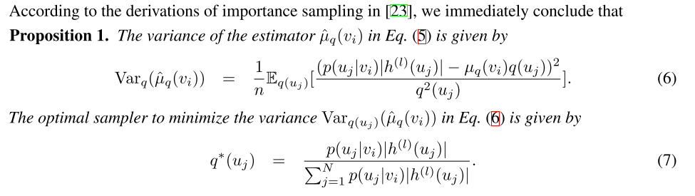

## 1. 算法的相关指标

对于不同的采样算法，有三个方面的指标：
1. 精度
    > 高精度实际对应的就是最小化的经验误差, 经验误差可以分为bias和variance项。这里假设噪声为0
    
2. 时间
    - 每轮的时间
    - 算法的收敛性
    > 算法的收敛性这里也认为与之相关[参考](https://zhuanlan.zhihu.com/p/86429808)
3. 内存

在[GraphSAGE](), [VRGCN](), [FastGCN](), [AS-GCN](), [LADIES](), [ClusterGCN](), [GraphSAINT](), [MVS-GNN](#ref-MVS-GNN)论文中，都认为采样算法相比full-batch所带来的variance是影响精度和算法收敛性的原因。所以各自的重点都在做variance reduction.

## 2. 采样算法概述

按采样方式，可以将采样算法分为三类（[LADIES](), [ClusterGCN](), [GraphSAINT](), [MVS-GNN]()），其中node-wise和layer-wise采样出的子图层之间的结构是不一样的，subgraph采样的子图每层之间的连接是一样的
1. node-wise: 
    - GraphSAGE: 每层每个节点均匀采样出k个邻居
    - VRGCN: 认为每次参数的更新变化很小，存在以下关系$h_v^{l+1} = \sum_{w \in \mathcal{N}(v)}{(\hat{h}_w^l + \triangle h_w^{(l)})}$, $\hat{h}_w^l$可以使用历史数据，这里只需要计算$\triangle h_w^{(l)}$, 所以可以取很小的k值;
2. layer-wise:
    - FastGCN: 将$h_v^{l+1} = \sum_{w \in \mathcal{N}(v)} h_w^l$转化为积分形式，因此可以认为进行importance sampling; 考虑最小化variance, 在参数更新上加上了因子的设计
    - AS-GCN: 根据FastGCN的采样公式，试图最小化variance，然后将其中某一不可计算项设置为独立项，重新设计了loss计算公式; 考虑了加入skip connection的影响
    - LADIES: 基于Layer Dependent进行importance sampling
3. subgraph:
    - ClusterGCN: 提出embedding utilization是影响计算效率的关键因素，认为聚类是提高embedding utilization的方法，采用了聚类算法进行了sampling; 为了减少variance, 采用的方法是合并不同的K个块，重新添加边
    - GraphSAINT: 使用aggergater和weight update中引入参数来解决了subgraph带来的bias问题；针对variance问题，通过度数的概率设计了node sampler, edge sampler, random walk base sampler三种采样算法

现有的采样算法总的模型都是以GCN为模型进行设计，其中
$$P^l = \tilde{A}, H^{l+1} = P^l H^{l} W^{l}$$
这里$P^l$是将$A$预处理得到的结果。

| 算法 |  github地址  |
| -- | ---|
| GraphSAGE | https://github.com/williamleif/GraphSAGE |
| VRGCN | https://github.com/thu-ml/stochastic_gcn |
| FastGCN |https://github.com/matenure/FastGCN |
| ASGCN | https://github.com/huangwb/AS-GCN |
| LADIES  | https://github.com/acbull/LADIES  |
| ClusterGCN | https://github.com/google-research/google-research/tree/master/cluster_gcn  |
| GraphSAINT | https://github.com/GraphSAINT/GraphSAINT  |
### 2.1 GraphSAGE
#### a. 背景介绍
从内容推荐到识别蛋白质功能，大规模图中中节点的低维嵌入已被证明是非常有用的。但是，大多数现有方法要求图中的所有节点在进行嵌入训练时都存在;这些以前的方法本质上是transductive，不会自然地泛化到看不见的节点。在这里，我们介绍 GraphSAGE，一个通用的归纳框架，它利用节点特征（例如文本属性）来有效地转化为。我们学习的不是为每个节点进行单个嵌入，而是通过采样和聚合节点的本地邻域信息来生成嵌入的函数。我们的算法在三个归纳节点分类基准上优于基准线。

#### b. 算法思想

#### c. 算法伪代码

#### d. 实验结果

### 2.2 VRGCN

#### a. 背景介绍
GCN之前的工作都在降采样邻居的数目，但是这些算法没有保证算法的收敛性，而且他们每个节点的感受野仍然在非常大的范围。
本文提出了基于control variate控制的随机近似算法。我们利用节点的历史激活作为控制变量。我们表明，虽然 NS 估计器的方差取决于激活的幅度，但我们的算法的方差仅取决于激活与其历史值之间的差值。此外，我们的算法带来了新的理论保证。在测试时，我们的算法提供精确和零方差预测，在训练时，我们的算法收敛到 GCN 的局部最佳值，而不考虑相邻采样大小 $D^l$。通过每个节点仅对两个邻域进行采样，从而可以显著降低时间复杂性，但仍保留模型的质量。

最终在六个数据集上的结果显示，本文的方法能够减小NS在相同感受野的梯度的bias和variance.并且，仅仅通过使用$D^l=2$邻居，本文的算法与精确算法一样达到了通用的预测表现，同时也表现了很好的收敛性。在Reddit数据集上，训练时间比GCN, GraphSAGE, FastGCN快了7倍以上

#### b. 算法原理

> - Excat: full-batch训练
> - Neigbor sampling: GraphSAGE邻居采样
> - Control variate: 论文提出的采样方法1
> - CVD network(control variate for dropout): 论文提出的采样方法2

**control variate机制**

**preprocessing strategy(dropout)**

> 这篇论文中使用了后者

**模型**

#### c. 算法伪代码

#### d. 实验结果

> M0表示$Z^{l+1}=PDropout_p{H^{(l)}}W^{(l)}$, M1表示$Z^{l+1}=Dropout_p{P H^{(l)}}W^{(l)}$, M1+PP表示sampling $D^{l}=20$个邻居和预处理$PH^{(0)}$

### 2.3 FastGCN

#### 
GCN面临的一个更严重的挑战是，跨层邻域的递归扩展在批处理训练中会产生昂贵的计算。特别是对于密集图形和电源图，单个顶点的邻域扩展会快速填满图形的很大一部分。然后，通常的小型批量培训将涉及每个批次的大量数据，即使批量较小。因此，可扩展性是GCN适用于大型密集图形的紧迫问题。
为了解决这两个挑战，我们建议从不同的角度查看图形卷积，并将其解释为在概率度量下嵌入函数的积分变换。这种观点为归纳学习提供了一个原则性机制，从损耗的公式到梯度的随机版本。具体来说，我们解释图形顶点是某种概率分布的iid样本，并将损耗和每个卷积层写入顶点嵌入函数的积分。然后，通过蒙特卡罗近似值计算积分，该近似值定义了样品损耗和样本梯度。可以进一步更改采样分布（如重要性采样），以减少近似方差。
本文提出的采样方法FastGCN，不仅摆脱了对测试数据的依赖，而且产生了可控制的每个批次计算成本。GraphSAGE（Hamilton等人，2017年）也建议使用采样来减少GCN的计算占用空间。本文的采样方案更经济，在梯度计算中节省了大量成本。
实验结果表明，FastGCN的每个批次计算速度比GraphSAGE快一个数量级以上，而分类精度则具有高度可比性。
#### a. 算法原理

#### b. 算法流程

> 这里$\hat{A} = P$, 红圈为variance reduction的操作

#### c. 实验结果

### 2.4 AS-GCN

#### a. 背景介绍
GNNs最明显的一个挑战就是scalability, 因为计算卷积往往需要扩层领域的递归扩展，这在计算上需要大量的内存占用，即使是单个节点，领域扩展也可能将整个图包含进来。所以传统的mini-batch训练也不能加快卷积计算，因为每个batch会涉及到大量的顶点，即使batch size很小的情况下。

为了避免over-expansion问题，我们通过加速了GCNs的训练通过控制每层采样的邻居的大小。我们建立网络结构的方法为top-down, 即lower layer基于upper layer采样得到。
这样的layer-wise采样方法有两个有点：第一，我们可以重用采样到的邻居的信息；第二，这样可以固定每层的大小从而避免over-expansionentity

本文方法的核心是设计合理的sampler, 一个优化的目标就是最小化resulting variance. 不幸地，在本文设计的top-down sampling和bottom-up propagation的网络中，the optimal sampler to minimize the variance 是不可计算的。为了解决这个问题，本文将一个不可计算的部分替代为了self-dependent function, 然后add the variance to the loss function. 
其次，我们探索了如何enable efficient message passing across distant nodes. 现有的方法是resort random walkds来产生邻居的various steps, 蘘荷整合到多跳邻居中。在本文中提出了一个新的机制, 在l-1层和l+1层之间skip connection，这个链接重用了l-1层的节点作为l+1层的2跳邻居。

本文的贡献：
1. 提出了新的layer-wise的采样方法, between-layer information是共享的，the size of the sampling nodes是可以控制的
2. layer-wise sampling的采样算法是adptive,可以在训练过程中进行训练
3. 提出了一个有效的两层之间的skip connection。
本文的实验在Cora, Citeseer, Pubmed和Reddit上都取得了很好的分类精度和收敛速度

#### b. 算法原理

**Explicit Variance Reduction**

loss

**Preserving Second-Order Proximities by Skip Connections**

#### c. 实验结果

### 2.5 LADIES

#### a. 背景介绍

为了解决full-batch训练带来的computation dependency的指数级增长，现有两个方向来解决这个问题：
1. node-wise neighbor sampling, 比如GraphSAGE, 通过uniform sampling出固定数目的邻居。这种方法会带来冗余计算[11]的问题，尽管两个邻居可能采样的是相同的邻居，这些邻居的表示会被计算两次，并且冗余计算会随着层数变化而增加; VRGCN通过利用variance reduction技术提高了采样的复杂度，ClusterGCN将采样的邻居限制在了dense subgraph; 
2. layer-wise importance-sampling方法。FastGCN基于每个顶点的度数计算了采样的概率，然后每层采样了固定数目的节点; 然而，在这种采样方法中，每一层的采样概率是独立的，这导致两个连续层之间不一定相互连接，从而导致采样得到的邻接矩阵异常稀疏。为了解决inter-layer correlation和reduce the estimation variance, huang[11]提出了adaptive和trainable采样方法，最终取得了很好的精度，但是[11]的方法没有很好的理论和实际证明。

综合上面采样方法的优缺点，我们认为一个理想的采样算法应该包括如下的特征:
1. layer-wise, the neigbor nodes可以被考虑到计算下一层的表示，并且没有冗余
2. neighbor-dependent, 采样到的邻接矩阵应该稠密，不能丢失太多的训练信息
3. importance samling方法应该被采样来reduce the sampling variance和accelerate convergence.
基于以上，本文提出一个新的采样算法，LAyer-Dependene ImportancE-Sampling(LADIES)

算法的流程如下
1. 对于当前层l, 基于上一层l+1采样，从图中采样它们的所有邻居，构建二分图
2. 根据顶点的阶数计算采样的概率来reduce sampling variance
3. 基于概率采样固定数目的邻居
4. 构建最后的邻接矩阵，用于训练

本文的贡献：
1. 提出了LADIES算法，避免了接受域指数级增长的问题和采样子图之间的连接性
2. 理论上证明了该算法拥有更好的内存和时间复杂度，相比于之前的算法
3. 在benchmark adtasets上再running time和test accuracy都取得了非常好的精度

#### b. 算法原理

**Notations, Summary of Complexity and Variance**

#### c. 算法流程

#### d. 实验结果

### 2.6 ClusterGCN

#### a. 背景介绍
对于一个图，GCN采用图卷积运算逐层地获取节点的embedding：在每一层，要获取一个节点的embedding，需要通过采集相邻节点的embedding，然后进行一层或几层线性变换和非线性激活。最后一层embedding将用于一些最终任务。例如，在节点分类问题中，最后一层embedding被传递给分类器来预测节点标签，从而可以对GCN的参数进行端到端的训练。

由于GCN中的图卷积运算（operator）需要利用图中节点之间的交互来传播embeddings，这使得训练变得相当具有挑战性。不像其他神经网络，训练损失可以在每个样本上完美地分解为单独的项（decomposed into individual terms），GCN中的损失项(例如单个节点上的分类损失)依赖于大量的其他节点，尤其是当GCN变深时。由于节点依赖性，GCN的训练非常慢，需要大量的内存——反向传播需要将计算图上的所有embeddings存储在GPU内存中。

**现有算法的缺陷**
为了证明开发可扩展的GCN训练算法的必要性，文中首先讨论了现有方法的优缺点，包括：内存需求、每个epoch的时间、每个epoch收敛速度。

这三个因素是评估训练算法的关键。注意，内存需求直接限制了算法的可扩展性，后两个因素结合在一起将决定训练速度。在接下来的讨论中，用N为图中的节点数，F为embedding的维数，L为分析经典GCN训练算法的层数。

GCN的第一篇论文提出了全批次梯度下降（Full-batch gradient descent）。要计算整个梯度，它需要存储所有中间embeddings，导致O(NFL)内存需求，这是不可扩展的。
GraphSAGE中提出了Mini-batch SGD。它可以减少内存需求，并在每个epoch执行多次更新，从而加快了收敛速度。然而，由于邻居扩展问题，mini-batch SGD在计算L层单个节点的损失时引入了大量的计算开销。
VR-GCN提出采用variance减少技术来减小邻域采样节点的大小。但它需要将所有节点的所有中间的embeddings存储在内存中，从而导致O(NFL)内存需求。

作者定义了“Embedding utilization”的概念来表达计算效率。如果节点i在第l层的embedding在计算第l+1层的embeddings时被重用了u次，那么就说相应的的embedding utilization是u。

下表中总结了现有GCN训练算法相应的时间和空间复杂度。显然，所有基于SGD的算法的复杂度都和层数呈指数级关系。对于VR-GCN，即使r很小，也会产生超出GPU内存容量的巨大空间复杂度。

本文提出的的Cluster-GCN算法，它实现了两全其美的效果：即每个epoch和full gradient descent具有相同的时间复杂度， 同时又能与朴素GD具有相同的空间复杂度。

#### b. 算法原理

文中的Cluster-GCN技术是由以下问题驱动的：在mini-batch SGD更新中，我们可以设计一个batch和相应的计算子图来最大限度地提高embedding utilization吗？文中使用了图聚类算法来划分图。图聚类的方法，旨在在图中的顶点上构建分区，使簇内连接远大于簇间连接，从而更好地捕获聚类和社区结构。

下图展示了两种不同的节点分区策略：随机分区和clustering分区。可以看到，cluster-GCN可以避免大量的邻域搜索，并且集中在每个簇中的邻居上。作者使用随机分割和Metis聚类方法将图分成10个部分。然后使用一个分区作为一个batch来执行SGD更新。在相同的时间段内，使用聚类划分可以获得更高的精度。这表明使用图聚类是很重要的，分区不应该随机形成。

**随机多聚类**
尽管朴素Cluster-GCN实现了良好的时间和空间复杂度，但仍然存在两个潜在问题：
- 图被分割后，一些连接被删除。因此，性能可能会受到影响。
- 图聚类算法往往将相似的节点聚集在一起，因此聚类的分布可能不同于原始数据集，从而导致在执行SGD更新时对 full gradient的估计有偏差。

为了解决上述问题，文中提出了一种随机多聚类方法，在簇接之间进行合并，并减少batch间的差异（variance）。作者首先用一个较大的p把图分割成p个簇V1,...,Vp，然后对于SGD的更新重新构建一个batch B，而不是只考虑一个簇。随机地选择q个簇，定义为t1,...,tq ,并把它们的节点包含到这个batch B中。此外，在选择的簇之间的连接也被添加回去。作者在Reddit数据集上进行了一个实验，证明了该方法的有效性。

#### c. 算法流程

> 此文中还提到了一些变形公式，比如$X^{l+1}=\delta(AX^{l}W^{l})+X^{l}$, $X^{l+1}=\delta((A+I)X^{l}W^{l})$

#### d. 实验结果
文中评估了所提出的针对四个公共数据集的多标签和多类分类两个任务的GCN训练方法，数据集统计如表3所示。Reddit数据集是迄今为止为GCN所看到的最大的公共数据集，为了测试GCN训练算法在大规模数据上的可扩展性，作者基于Amazon co-purchase network构建了一个更大的图Amazon2M，包含超过200万个节点和6100万条边。

作者比较了不同层次GCNs的VRGCN在训练时间、内存使用和测试准确度(F1分数)方面的差异。从表中可以看出
- 训练两层时VRGCN比Cluster-GCN快，但是当增加一层网络，却慢于实现相似准确率的Cluster-GCN；
在内存使用方面，VRGCN比Cluster-GCN使用更多的内存(对于三层的情况5倍多)。
- 当训练4层GCN的时候VRGCN将被耗尽，然而Cluster-GCN当增加层数的时候并不需要增加太多的内存，并且Cluster-GCN对于这个数据集训练4层的GCN将实现最高的准确率。

**Tensorflow vs PyTorch**

### 2.7 GraphSAINT

#### a. 背景介绍
**传统GNN挑战：邻居爆炸（Neighbor Explosion）**
邻居爆炸：
GNN会不断地聚合图中相邻节点的信息，则L-层的GNN中每个目标节点都需要聚合原图中L-hop以内的所有节点信息。在大图中，邻节点的个数可以随着L指数级增长。

邻点爆炸式增长，使得GNN的minibatch训练极具挑战性。
受显存的因素限制，GNN在不损失精度的前提下，难以高效地被拓展到大于两层的模型（否则指数爆炸）。

**现有方法：图采样**

Layer-wise Sampling：
邻居爆炸：在矩阵采样多层时，假设每层采样n个邻居，则会导致n^2级别的节点扩充速度。
领接矩阵稀疏：在矩阵采样的过程中，会导致邻接矩阵稀疏化，丢失一些本来存在的边。
时间耗费高：每一层卷积都要采样，这就导致计算的时间耗费。
前人工作提出了众多基于采样邻居节点的方法，并利用多类型的聚合函数提高模型的表达能力。大部分现有工作都在探索如何通过对GNN每层的节点进行采样，以降低训练成本。

Graph-wise Sampling：
从原图上采样一个子图下来，在这个子图上做局部的、完全展开的GCN。
解决了邻居采样的指数化问题，而且可以对采下来的子图进行直接的并行化，就大大的改进了效率。即，可以在preprocess阶段提前采样图，并且可以进行mini batch的加速。
但是这样的采样往往会丢失一些信息。

属于Graph sampling。
从原图中采样子图，在子图上使用GCN学习。
基于极其轻量级的子图采样算法，同时实现了在准确率和复杂度上的显著提升。
提出了适用于大图以及深层网络的，通用的训练框架。
在标准的Reddit数据集上，以100倍的训练时间提速，提高了1%以上的准确率。在这里插入图片描述
#### b. 算法原理
将全图进行多次采样，在得到的sub-graph上进行全GCN，然后将多个sub-graph的信息融合起来。

本文的采样是基于节点的连通性：
1. 相互影响较大的节点应在同一子图中采样，intra sub-graph的节点是具有强联系的，但这就引入了采样的bias。理想的SAMPLE要求衡量节点连接的联合信息以及属性。但这种算法可能具有很高的复杂度，所以，为简单起见，从图连接性角度定义“影响力”，并设计基于拓扑的采样器。
2. 为了消除保留图连通性特征的采样器引入的偏差，作者引入自行设计的归一化技术，以消除偏差，使得估计量无偏。归一化系数通过pre-processing估计出来。
3. 每条边的采样概率均不可忽略，使得神经网络能够探索整个特征和标签空间。
4. 考虑variance reduction（降低采样方差），旨在得到最小方差的边采样概率。

重点是估计每个节点、边、子图的采样概率。

- 节点采样概率：

- 边采样概率:

- 子图采样概率：

> 这篇文章的采样sub-graph的概念应该是介于AS-GCN的“有条件的采样全图”和ClusterGraph的“将图聚类后采样”之间。由于采样的存在，FastGCN, AS-GCN等在不同的layer计算的是不同的图结构，而GraphSAINT, ClusterGraph可以看做在不同layer都对同一个graph进行特征提取。

#### c. 实验结果
**F1-micro score**

**deep model**

**total_time**

**Effect of Batch Size**

### 2.8 MVS-GNN

#### a. 背景介绍

在大规模图上进行GNNs的训练仍然是一个很大的问题，这主要是因为图中节点之间的相互依赖。在GNNs中，节点表示通过聚集邻居上一层的表示得到。由此，跟其他神经网络的最终的输出和梯度由数据分解得到不一样，GNNs的embedding由其邻居的embedding递归得到，dependency由此随着层的数量指数级上升，即neigbor explosion。为了缓解这个问题, 有mini-batch方法提出，比如node-wise sampling, layer-wise sampling, subgraph sampling。

尽管实证结果展示上面的算法可以将GNN训练扩展到大规模数据集，但是这些采样方法仍然会产生high variance, 从而破坏收敛性和繁华性。为了减小采样方法的variance, 我们可以增加每层的mini-batch的大小或者应用adaptive sampling方法(gradient information of representations). 计算和内存要求会对采样节点的大小进行限制。

在importance sampling, adpative sampling方法中，关键的想法是利用优化期间的梯度信息采样训练数据来减小无偏随机梯度的方差。近期，不同的adaptive sampling方法，importance sampling, adaptive importance sampling, gradient-based sampling, safe adaptive sampling, bandit sampling. 尽管这些采样方法通过SGD保证了训练的结果，但是这些方法的概括却不是很直接。

本文认为由于训练目标的复合结构，stochastic gradient是full-batch的biased estimation, 因此可以分为两个部分：embedding approximation variance(因为每层采样到的是邻居的子集)和stochastic gradient variance(因为这里用mini-batch的梯度进行估计full-batch的梯度)。并且，stochastic gradient的bias和embedding approximation variance成正比，随着stochastic gradient variance减小为0，stochastic gradient趋向于五篇。

本文所提出的minminval variance sampling schema即MVS-GNN, 利用了优化过程中的动态信息来采样节点信息，包含了两个方面的内容：1. explicit embedding variance by utilizing the history of embdding of nodes 2. gradient-based minimal variance sampling by utilizaing the norm of gradient of nodes and solving an optimization problem.

实验结果表明，相比于其他采样算法，MVS-GNN在非常小的mini-batchs下达到了很高的收敛性和精度。

#### b. 算法原理
**decoupled variance reduction**

> 1. embedding approximation variance, 因为只有一小部分邻居被采样
> 2. stochastic gradient variance, 因为只有一个mini-batch的数据区估计full-batch的梯度

下表为不同采样算法的embedding approximation variance

作者这里的思路借用了VRGNN的做法，使用两层循环：
1. 外层大Batch：
2. 内层小Batch：小Batch从大Batch中采样，

**Gradient-based minimal variance sampling**
求解一下最优化问题：

结果：

#### c. 算法流程

#### d. 实验结果
**the effect if mini-batch size**

**effectiveness of variance reduction**

**evaluation of total time**

> - $T_{Sample}$表示构建20 mini-batchs for traning所花的时间
> - $T_{train}$表示运行20 mini-batchs所有的时间
> - $T_{Dists}$表示importance sampling所花的时间

**evaluation on small mini-batch size**

**evaluation on small mini-batch size**

## 参考文献

- <a name="ref-GraphSAGE">[GraphSAGE]</a>Hamilton, W. L., Ying, R., & Leskovec, J. (2017). Inductive Representation Learning on Large Graphs. NIPS, 2017-Decem(Nips), 1025–1035. Retrieved from http://arxiv.org/abs/1706.02216
- <a name="ref-VRGCN">[VRGCN]</a>Chen, J., Zhu, J., & Song, L. (2018). Stochastic training of graph convolutional networks with variance reduction. 35th International Conference on Machine Learning, ICML 2018, 3, 1503–1532.
- <a name="ref-FastGCN">[FastGCN]</a>Chen, J., Ma, T., & Xiao, C. (2018). FastGCN: Fast learning with graph convolu-tional networks via importance sampling. ICLR, 1–15.
- <a name="ref-AS-GCN">[AS-GCN]</a>Huang, W., Zhang, T., Rong, Y., & Huang, J. (2018). Adaptive sampling towards fast graph representation learning. Advances in Neural Information Processing Systems, 2018-Decem(NeurIPS), 4558–4567.
- <a name="ref-LADIES">[LADIES]</a>Zou, D., Hu, Z., Wang, Y., Jiang, S., Sun, Y., & Gu, Q. (2019). Layer-Dependent Importance Sampling for Training Deep and Large Graph Convolutional Networks. (NeurIPS).
- <a name="ref-ClusterGCN">[ClusterGCN]</a>Chiang, W. L., Li, Y., Liu, X., Bengio, S., Si, S., & Hsieh, C. J. (2019). Cluster-GCN: An efficient algorithm for training deep and large graph convolutional networks. SIGKDD, 257–266. https://doi.org/10.1145/3292500.3330925
- <a name="ref-GraphSAINT">[GraphSAINT]</a>Zeng, H., Srivastava, A., Prasanna, V., Zhou, H., & Kannan, R. (2020). GraphSAINT : GRAPH SAMPLING BASED INDUCTIVE LEARNING METHOD. (2018).
- <a name="ref-MVS-GNN">[MVS-GNN]</a>Cong, W., Forsati, R., Kandemir, M., & Mahdavi, M. (2020). Minimal Variance Sampling with Provable Guarantees for Fast Training of Graph Neural Networks. Retrieved from http://arxiv.org/abs/2006.13866